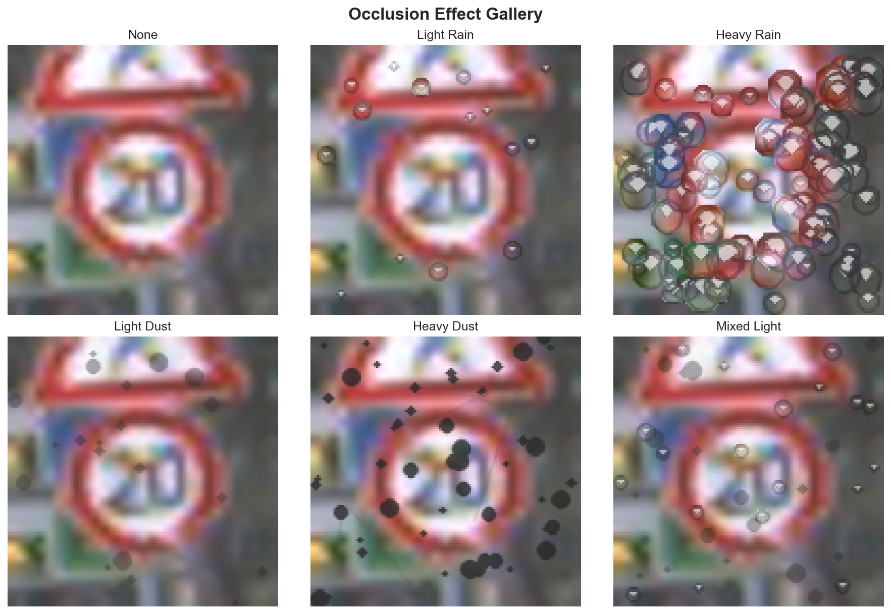
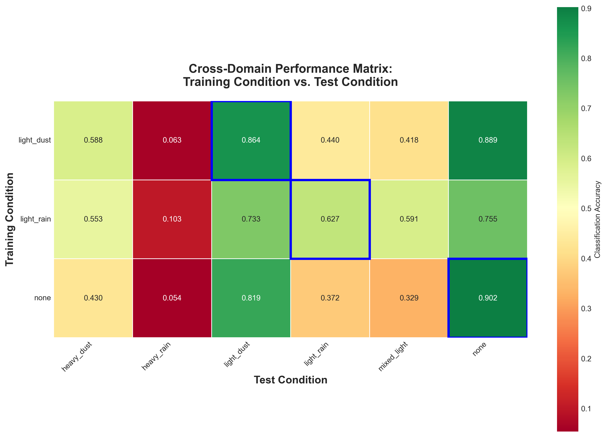

# CNN Robustness to Camera Occlusion

[](https://opensource.org/licenses/MIT)


This research project investigates the robustness of Convolutional Neural Networks (CNNs) against common camera occlusion effects like rain and dust. Using the German Traffic Sign Recognition Benchmark (GTSRB) dataset, we train models under various conditions and analyze their performance degradation and internal representations.

We define various sensor noise types using the [`camera_occlusion`](https://github.com/kilojoules/camera_occlusion) Python package:



Then train and evaluate CNNs to recognize GTSRB signs under these different weather conditions



## Key Features

* **Realistic Occlusion Effects:** Utilizes the `camera-occlusion` library to programmatically add rain and dust effects to training and test data.
* **Config-Driven Experiments:** The entire experimental workflow—from model architecture to training conditions and analysis parameters—is controlled via a central YAML configuration file.
* **Comprehensive Analysis:** Automatically generates a detailed markdown report with performance heatmaps, robustness metrics, and statistical significance tests.
* **Model Introspection Tools:** Provides command-line tools to visualize learned filters and feature map activations, allowing for deep inspection of model behavior under clean and noisy conditions.

## Project Structure

```
cnn-occlusion-robustness/
├── configs/
│   └── eval/
│       └── matrix.yaml        # Main config for experiments
├── results/                   # Raw output (models, eval JSONs, matrices)
├── analysis_output/           # Final reports and publication-quality figures
├── scripts/
│   ├── run_all.sh             # Main script to run the full pipeline
│   └── organize_test_set.py   # One-time script to structure the GTSRB test set
├── src/
│   └── cnn_occlusion_robustness/
│       ├── analysis/          # Analysis and visualization scripts
│       ├── data/              # Dataset handling
│       ├── models/            # CNN architecture definitions
│       ├── train.py           # Training script
│       └── eval.py            # Evaluation script
├── pyproject.toml             # Project definition and dependencies
└── README.md
```

## Setup and Installation

#### 1. Clone the Repository
```bash
git clone https://github.com/kilojoules/cnn-occlusion-robustness.git
cd cnn-occlusion-robustness
```

#### 2. Create a Virtual Environment
It's recommended to use a conda environment.
```bash
conda create -n robust_cnn python=3.11
conda activate robust_cnn
```

#### 3. Install Dependencies
Install the project in editable mode (`-e`), which automatically discovers and installs all dependencies from `pyproject.toml` and registers the command-line tools.
```bash
pip install -e .
```

#### 4. Download and Prepare the GTSRB Dataset
This project requires the image data for both the training and test sets.

1.  **Go to the official GTSRB archive:** [https://sid.erda.dk/public/archives/daaeac0d7ce1152aea9b61d9f1e19370/published-archive.html](https://sid.erda.dk/public/archives/daaeac0d7ce1152aea9b61d9f1e19370/published-archive.html)

2.  **Download the required files:** From the file list, you only need to download the following two zip archives:
    * `GTSRB_Final_Training_Images.zip` (The training set images)
    * `GTSRB_Final_Test_Images.zip` (The test set images and their ground truth CSV)

3.  **Arrange the data:** Create a parent directory for the dataset outside of the project folder. Unzip both archives into this directory. The final structure should look like this:
    ```
    ../
    ├── GTSRB_dataset/
    │   ├── GTSRB/
    │   │   └── Final_Training/
    │   │       └── Images/
    │   │           ├── 00000/
    │   │           ├── 00001/
    │   │           └── ... (41 other class folders)
    │   └── GTSRB_test/
    │       └── Final_Test/
    │           └── Images/
    │               ├── 00000.ppm
    │               ├── 00001.ppm
    │               ├── ...
    │               └── GT-final_test.test.csv
    └── cnn-occlusion-robustness/  (Your project folder)
    ```

4.  **Run the pre-processing script:** The training images are already organized into class folders, but the test images are not. The `organize_test_set.py` script reads the included `GT-final_test.test.csv` file and automatically moves each test image into a subfolder corresponding to its class label. This step is **mandatory** for the evaluation code to work.
    ```bash
    python scripts/organize_test_set.py
    ```
    After running, your `GTSRB_test/Final_Test/Images/` directory will now contain class folders (`00000`, `00001`, etc.), just like the training set.

## Running Experiments

#### 1. Configure Your Experiment
The entire experiment is controlled by `configs/eval/matrix.yaml`. Here you can define:
* `training_conditions`: A list of effects to train models on (e.g., `none`, `heavy_rain`).
* `test_conditions`: A list of effects to evaluate all trained models against.
* `model`: The CNN architecture and its hyperparameters (`kernel_size`, `channels`, etc.).
* Training parameters like `epochs` and `learning_rate`.

#### 2. Run the Full Pipeline
The easiest way to run a complete experiment is using the `run_all.sh` script.
```bash
bash scripts/run_all.sh
```
This script automates the four main phases of the experiment:
1.  **Training:** Trains a separate model for each condition in `training_conditions`.
2.  **Evaluation:** Evaluates every model against every condition in `test_conditions`.
3.  **Matrix Building:** Aggregates all evaluation results into a single CSV performance matrix.
4.  **Analysis:** Generates a comprehensive report, tables, and figures in the `analysis_output/` directory.

## Command-Line Tools

This project includes several command-line tools for running specific tasks or performing deeper analysis.

#### `analyze-results`
Generates the final analysis report from an existing set of results.
```bash
analyze-results --results-dir ./results --output-dir ./analysis_output
```

#### `visualize-filters`
Visualizes the learned kernels (filters) of a specific convolutional layer in a trained model. This is useful for seeing what low-level patterns the model has learned.

*Example: Visualize `conv1` filters from the `mixed_heavy` model:*
```bash
visualize-filters \
    --config configs/eval/matrix.yaml \
    --model-path results/models/mixed_heavy_model.pth \
    --output-path conv1_filters.png
```

*Example: Visualize `conv2` filters from the same model:*

The current script handles this by just showing the weights for the first input channel of each filter as a grayscale image, which is a common simplification but not always a complete picture.

```bash
visualize-filters \
    --config configs/eval/matrix.yaml \
    --model-path results/models/mixed_heavy_model.pth \
    --layer-name conv2 \
    --output-path conv2_filters.png
```

#### `visualize-activations`
Visualizes the feature map activations for a given input image. This shows how the model "sees" a specific image and which features are triggered by clean or occluded inputs.

*Example: See how the model activates on a clean test image:*
```bash
visualize-activations \
    --config configs/eval/matrix.yaml \
    --model-path results/models/mixed_heavy_model.pth \
    --image-path ../GTSRB_dataset/GTSRB_test/Final_Test/Images/00000/00243.ppm \
    --output-dir activations_clean
```

*Example: See activations for the same image but with a `heavy_dust` effect applied:*
```bash
visualize-activations \
    --config configs/eval/matrix.yaml \
    --model-path results/models/mixed_heavy_model.pth \
    --image-path ../GTSRB_dataset/GTSRB_test/Final_Test/Images/00000/00243.ppm \
    --test-effect heavy_dust \
    --output-dir activations_heavy_dust
```

## Understanding the Output

After a full run, the key outputs will be in:
* `results/`: Contains the trained models (`.pth`), individual evaluation scores (`.json`), and the final performance matrix (`.csv`).
* `analysis_output/`: Contains the final results.
    * `reports/comprehensive_analysis.md`: The main report with key findings.
    * `figures/performance_heatmap.png`: A visualization of the cross-domain performance matrix.
    * `tables/`: All calculated metrics in CSV format.

## Contributing

Contributions are welcome! Please feel free to submit a pull request or open an issue.

## License

This project is licensed under the MIT License. See the `LICENSE` file for details.
