# CNN Robustness to Camera Occlusion

[](https://opensource.org/licenses/MIT)


This research project investigates the robustness of Convolutional Neural Networks (CNNs) against common camera occlusion effects like rain and dust. Using the German Traffic Sign Recognition Benchmark (GTSRB) dataset, we train models under various conditions and analyze their performance degradation and internal representations.

We define various sensor noise types using the [`camera_occlusion`](https://github.com/kilojoules/camera_occlusion) Python package:


Then train and evaluate CNNs to recognize GTSRB signs under these different weather conditions


## Key Features

* **Realistic Occlusion Effects:** Utilizes the `camera-occlusion` library to programmatically add rain and dust effects to training and test data.
* **Config-Driven Experiments:** The entire experimental workflow—from model architecture to training conditions and analysis parameters—is controlled via a central YAML configuration file.
* **Comprehensive Analysis:** Automatically generates a detailed markdown report with performance heatmaps, robustness metrics, and statistical significance tests.
* **Model Introspection Tools:** Provides command-line tools to visualize learned filters and feature map activations, allowing for deep inspection of model behavior under clean and noisy conditions.

## Project Structure

```
cnn-occlusion-robustness/
├── configs/
│   └── eval/matrix.yaml          # Main experiment configuration
├── results/                      # Raw output (models, eval JSONs)
├── analysis_output/              # Final reports and figures
├── scripts/
│   ├── run_all.sh                # Main pipeline script
│   ├── organize_test_set.py      # Data pre-processing script
│   └── tune.py                   # Hyperparameter tuning script
├── src/
│   └── cnn_occlusion_robustness/
│       ├── analysis/             # Analysis and visualization scripts
│       ├── data/                 # Dataset handling
│       ├── models/               # CNN architecture definitions
│       ├── train.py              # Training script
│       └── eval.py               # Evaluation script
├── tests/                        # Unit and integration tests
├── pyproject.toml                # Project definition and dependencies
└── README.md
```

## Setup and Installation

#### 1. Clone the Repository
```bash
git clone https://github.com/kilojoules/cnn-occlusion-robustness.git
cd cnn-occlusion-robustness
```

#### 2. Create a Virtual Environment
It's recommended to use a conda environment.
```bash
conda create -n robust_cnn python=3.11
conda activate robust_cnn
```

#### 3. Install Dependencies
Install the project in editable mode (`-e`), which automatically discovers and installs all dependencies from `pyproject.toml` and registers the command-line tools.
```bash
pip install -e .
```

#### 4. Download and Prepare the GTSRB Dataset
This project requires the image data for both the training and test sets.

1.  **Go to the official GTSRB archive:** [https://sid.erda.dk/public/archives/daaeac0d7ce1152aea9b61d9f1e19370/published-archive.html](https://sid.erda.dk/public/archives/daaeac0d7ce1152aea9b61d9f1e19370/published-archive.html)

2.  **Download the required files:** From the file list, you only need to download the following two zip archives:
    * `GTSRB_Final_Training_Images.zip` (The training set images)
    * `GTSRB_Final_Test_Images.zip` (The test set images and their ground truth CSV)

3.  **Arrange the data:** Create a parent directory for the dataset outside of the project folder. Unzip both archives into this directory. The final structure should look like this:
    ```
    ../
    ├── GTSRB_dataset/
    │   ├── GTSRB/
    │   │   └── Final_Training/
    │   │       └── Images/
    │   │           ├── 00000/
    │   │           ├── 00001/
    │   │           └── ... (41 other class folders)
    │   └── GTSRB_test/
    │       └── Final_Test/
    │           └── Images/
    │               ├── 00000.ppm
    │               ├── 00001.ppm
    │               ├── ...
    │               └── GT-final_test.test.csv
    └── cnn-occlusion-robustness/  (Your project folder)
    ```

4.  **Run the pre-processing script:** The training images are already organized into class folders, but the test images are not. The `organize_test_set.py` script reads the included `GT-final_test.test.csv` file and automatically moves each test image into a subfolder corresponding to its class label. This step is **mandatory** for the evaluation code to work.
    ```bash
    python scripts/organize_test_set.py
    ```
    After running, your `GTSRB_test/Final_Test/Images/` directory will now contain class folders (`00000`, `00001`, etc.), just like the training set.

## Running Experiments

#### 1. Configure Your Experiment
The entire experiment is controlled by `configs/eval/matrix.yaml`. Here you can define:
* `training_conditions`: A list of effects to train models on (e.g., `none`, `heavy_rain`).
* `test_conditions`: A list of effects to evaluate all trained models against.
* `model`: The CNN architecture and its hyperparameters (`kernel_size`, `channels`, etc.).
* Training parameters like `epochs` and `learning_rate`.

#### 2. Run the Full Pipeline
The easiest way to run a complete experiment is using the `run_all.sh` script.
```bash
bash scripts/run_all.sh
```
This script automates the four main phases of the experiment:
1.  **Training:** Trains a separate model for each condition in `training_conditions`.
2.  **Evaluation:** Evaluates every model against every condition in `test_conditions`.
3.  **Matrix Building:** Aggregates all evaluation results into a single CSV performance matrix.
4.  **Analysis:** Generates a comprehensive report, tables, and figures in the `analysis_output/` directory.

## Command-Line Tools

This project includes several command-line tools for running specific tasks or performing deeper analysis.

#### `analyze-results`
Generates the final analysis report from an existing set of results, including the above heatmap.
```bash
analyze-results --results-dir ./results --output-dir ./analysis_output
```

#### `visualize-filters`
Visualizes the learned kernels (filters) of a specific convolutional layer in a trained model. This is useful for seeing what low-level patterns the model has learned.

*Example: Visualize `conv1` filters from the `mixed_heavy` model:*
```bash
visualize-filters     --config configs/eval/matrix.yaml     --model-path results/models/light_rain_model.pth     --output-path conv1_filters.png
```
Trained light rain model filters:

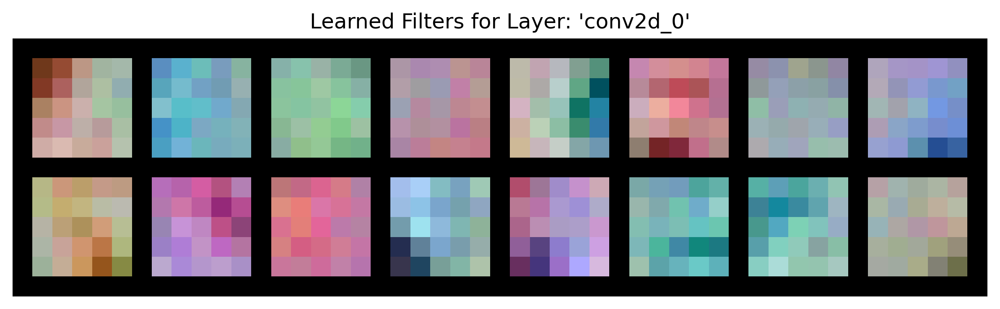

Model trained on light dust:


Trained model filters with no occlusion:

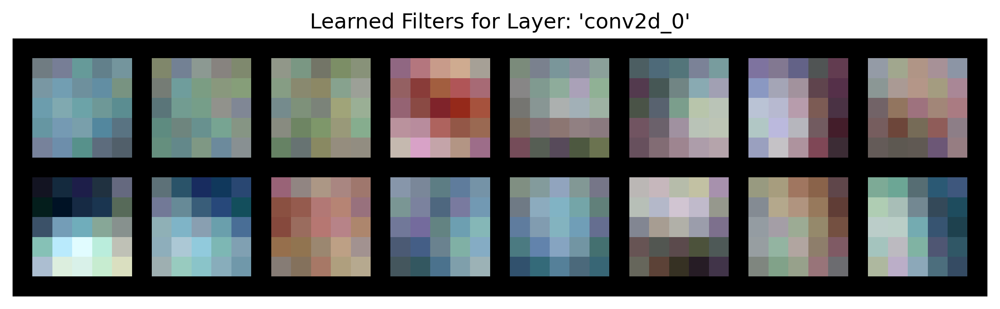

The filters in the model trained with the clean data are sharper wiith more distinct gradients, while the filters in the models trained with sampled sensor occlusion seem less focused on razor-sharp edges and more on color gradients and textures. This suggests the rain-trained model may be learning to average out or ignore the high-frequency noise introduced by rain streaks, focusing instead on the larger, more consistent shapes underneath.

*Example: Visualize `conv2` filters from the same model:*

The current script handles this by just showing the weights for the first input channel of each filter as a grayscale image, which is a common simplification but not always a complete picture.

```bash
visualize-filters \
    --config configs/eval/matrix.yaml \
    --model-path results/models/mixed_heavy_model.pth \
    --layer-name conv2 \
    --output-path conv2_filters.png
```

#### `visualize-activations`
Visualizes the fundamental pattern detectors (convolutional kernels) that the model learns during training. Think of each filter as a specialized magnifying glass 🕵️ one learns to find vertical edges, another looks for the color red, and another for a specific curve or texture. This tool shows you a picture of the exact pattern each "magnifying glass" is searching for as it slides across an image.

This is powerful because it reveals how a model's core perception strategy changes based on its training data.

*Example: See how the model activates on a clean test image:*
```bash
visualize-activations \
    --config configs/eval/matrix.yaml \
    --model-path results/models/mixed_heavy_model.pth \
    --image-path ../GTSRB_dataset/GTSRB_test/Final_Test/Images/00000/00243.ppm \
    --output-dir activations_clean
```

*Example: See activations for the same image but with a `heavy_dust` effect applied:*
```bash
visualize-activations \
    --config configs/eval/matrix.yaml \
    --model-path results/models/mixed_heavy_model.pth \
    --image-path ../GTSRB_dataset/GTSRB_test/Final_Test/Images/00000/00243.ppm \
    --test-effect heavy_dust \
    --output-dir activations_heavy_dust
```
In this example, we show the activation function associated with this image in each layer of our models

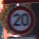

Activations for light dust:

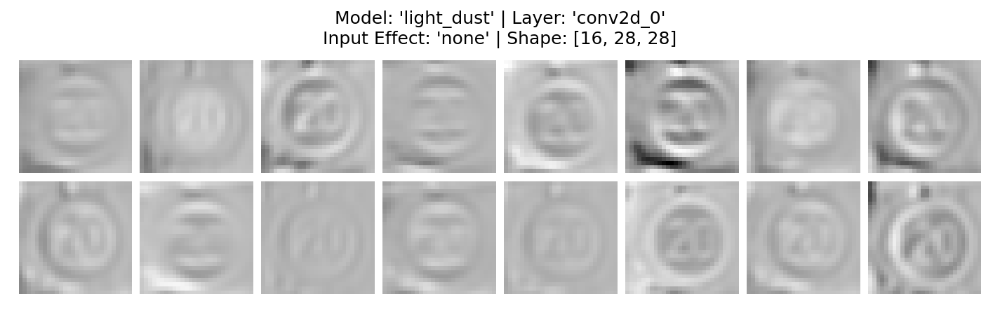
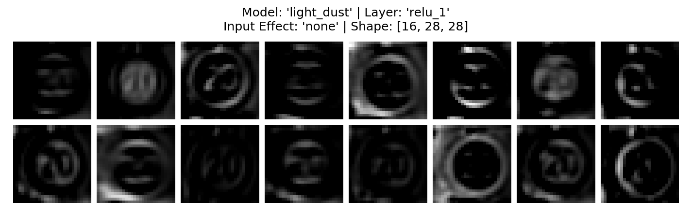
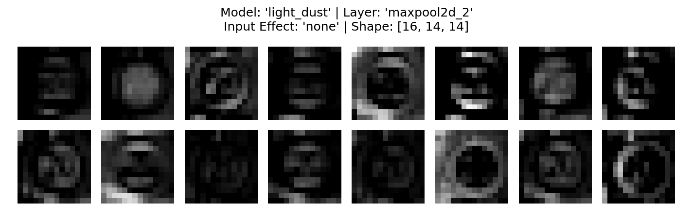

Activations for no occlusion:

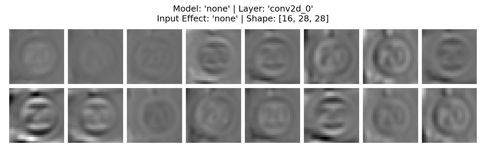
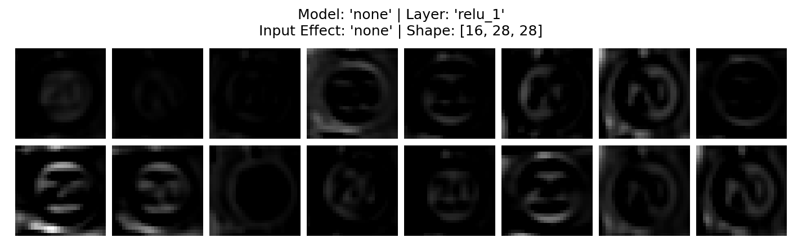
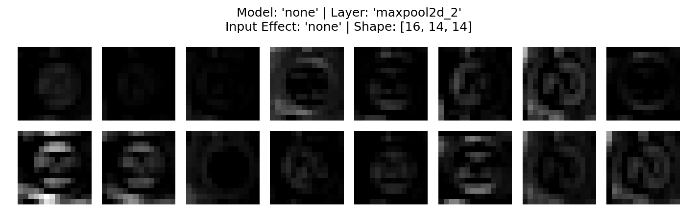

The activations tell a fascinating story about the models' different processing strategies. The most interesting trend is **Sparsity vs. Density**.

**Activations for the "Clean" Model:** This model is confident and efficient. Notice how after the first layer (conv2d_0), and especially after the ReLU activation (relu_1), many of the feature maps are almost entirely black. This is called **sparse activation**. The model quickly identifies the most important features—the sharp edges of the "20" and the circular border—and effectively ignores the rest. It's confident about what matters and discards irrelevant information early on.

**Activations for the "Light Dust" Model:** This model is more cautious and vigilant. The activations are noticeably denser; far fewer feature maps are completely black. More neurons remain active throughout the layers.


**Why is this happening?** Because this model was trained on noisy, ambiguous data, it can't be as certain about what's signal (the sign) and what's noise (a dust particle). Instead of discarding information, it keeps more features "alive" for later layers to process. It's essentially saying, "This might be important, let's keep it for now," making it more robust to unpredictable noise.

#### `plot-training-curves`
Generates plots of training and validation loss/accuracy over epochs for each trained model. This is useful for diagnosing issues like overfitting or poor convergence.

*Example: Generate plots for all models and save them to the analysis directory:*
```bash
plot-training-curves \
    --results-dir results/models/ \
    --output-dir analysis_output/figures/training_curves \
    --smooth-k 3
```
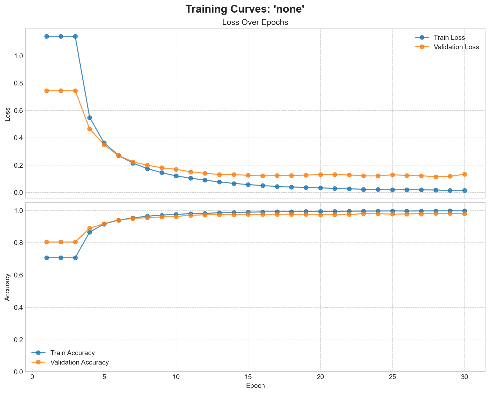
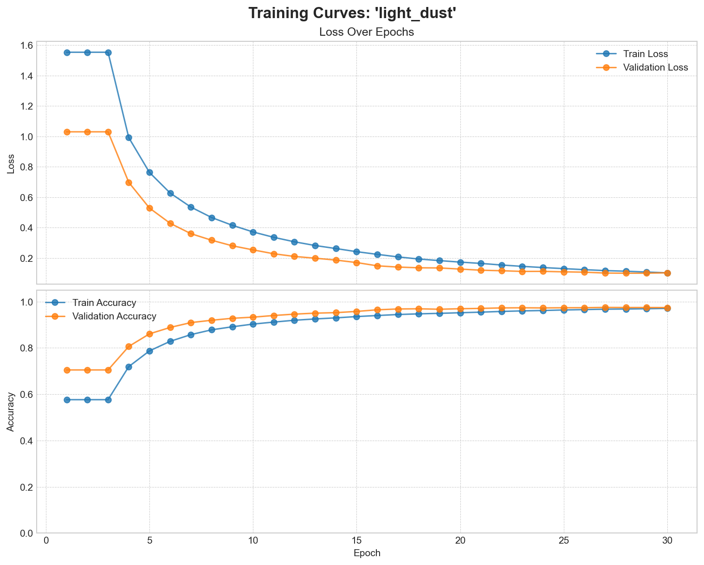
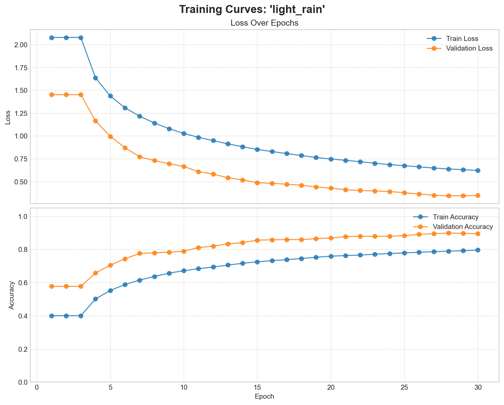


## Contributing

Contributions are welcome! Please feel free to submit a pull request or open an issue.

## License

This project is licensed under the MIT License. See the `LICENSE` file for details.
